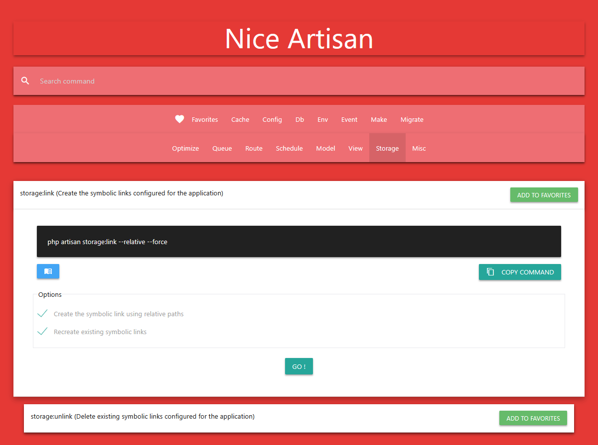

## Nice Artisan: A Web Interface for Laravel Commands 🚀 ##

This package provides a smooth, secure, and insightful web interface for managing and executing your Laravel application's Artisan commands.

---

### Features

Nice Artisan provides a secure and informative way to manage your application's commands:

* **Command Catalog & Documentation (New!):** Browse all your Laravel core commands and custom commands. **Each command now includes integrated documentation**, offering a quick, didactic reference right where you need it.
* **Dynamic Execution Forms:** Automatically generates intuitive form fields for all required arguments and optional options (including checkboxes for flags).
* **Real-Time Command Preview:** As you fill out the form fields, the full `php artisan ...` command is **generated and displayed in real-time**, ready to be copied to your clipboard.
* **Favorites System:** Mark frequently used commands as favorites for quick access and streamlined workflow.
* **History:** Keeps the last commands
* **Search Functionality:** Easily find any command or filter by command type using the built-in search feature.
* **Security Focused:** Mandatory middleware configuration is required to protect the interface, especially in production environments.

---

### Command Documentation ###

Command documentation files are located in the `resources/commands` directory. Any contributions via pull requests to improve this documentation are welcome.

---

### Quick Installation ###

Add Nice Artisan to your **composer.json** file :
```
    composer require bestmomo/nice-artisan
```

It will now be accessible at the following URL:
```
    .../niceartisan
```

### Middleware (security) ###

If you want to use this package on a production application, **you must protect the urls with a middleware** for your security !

To add a middleware for the package publish the configuration:
```
php artisan vendor:publish --tag=niceartisan:config
```

You can now define your protection logic. Add a route middleware to your application, for example:

```
<?php

namespace App\Http\Middleware;

use Closure;
use Illuminate\Http\Request;
use Symfony\Component\HttpFoundation\Response;  

class NiceArtisanProtection
{
  /**
  * Handle an incoming request.
  *
  * @param \Closure(\Illuminate\Http\Request): (\Symfony\Component\HttpFoundation\Response) $next
  */
  public function handle(Request $request, Closure $next): Response
  {
    // EXAMPLE: Only allow access in 'local' environment
    if (app()->isProduction()) 
    {
      abort(403, 'Nice Artisan is not allowed in production.');
    }
    
    // OR: Check if the user is authenticated and is an admin
    // if (! auth()->check() || ! auth()->user()->isAdmin())
    // {
    //   abort(403);
    // }

    return $next($request);
  }
}
```

Add the middleware to the `bootstrap/app.php` file:

```
->withMiddleware(function (Middleware $middleware) {
  $middleware->alias([
    'niceartisan' => \App\Http\Middleware\NiceArtisan::class,
  ]);
})
```

---
### Screenshots ###



